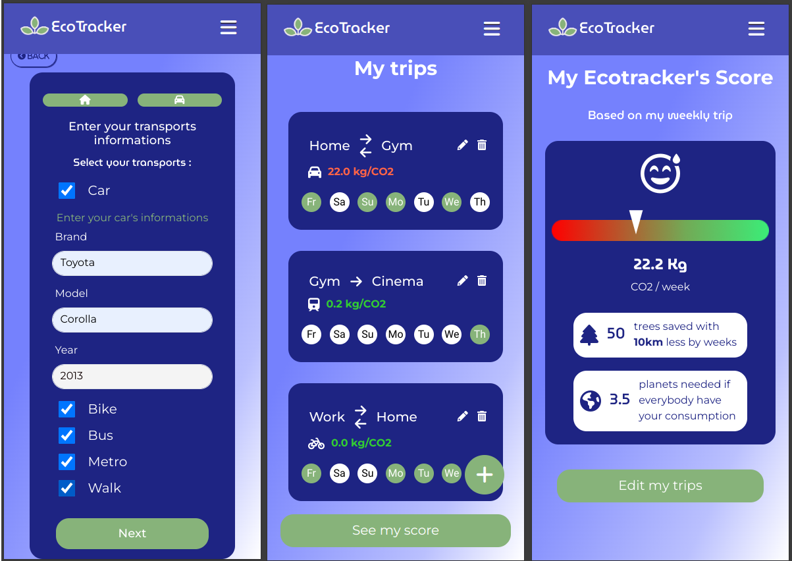

ECOTRACKER

EcoTracker is a mobile application that allows you to track your CO2 emissions based on your travel and the modes of transportation you use. With EcoTracker, you can compare your impact with the Canadian average to see if you are above or below this average.

Access the Application
The application is accessible via this link: https://ecotracker-806ded6e78fc.herokuapp.com/

FEATURES:

-Creation of Recurring Places: Add places you regularly visit, such as your home or workplace.

-Trip Creation: Record your usual trips by specifying the starting place, destination, mode of transportation (car, bus, metro, walking, biking), and the days of the week you take these trips.

-CO2 Emissions Calculation: Track your weekly CO2 emissions on a dedicated page that displays your score.

-Vehicle Personalization: If you use a car, enter the make, model, and year of your vehicle for precise CO2 consumption calculations using a dedicated API.

-Comparison with Canadian Average: Find out if you are above or below the average CO2 emissions in Canada.

-Additional Information: Get data such as the number of planets needed if everyone emitted as much CO2 as you, and the money saved by using more eco-friendly transportation methods.

USER JOURNEY:

-Sign Up: Create an account with your email and password if you don't have one.

-Add Places: Add places you frequently visit.

-Choose Transportation Modes: Select the transportation modes you use (car, bike, bus, walking, metro).

-Enter Vehicle Details: If you use a car, provide the details of your vehicle.

-Create Trips: Add trips by specifying the starting place, destination, transportation mode, days of the week, and whether it's a round trip or not.

-Manage Trips: Modify or delete your trips as needed.

-Manage Places: Delete and recreate places as needed.

-View Score: Check your weekly score with detailed information on your CO2 emissions.

TECHNOLOGIES USED:

-Frontend: Bootstrap and Stimulus for a responsive and interactive user interface.

-Backend: Ruby on Rails for API management and application logic.

-Database: SQL for storing user and trip data.

-External API: Integration of an API for calculating vehicle CO2 emissions.

CONTACT

For any questions or suggestions, please create an issue on the GitHub repository or contact the project maintainer directly.

Thank you for using EcoTracker to make your travels more eco-friendly and contribute to a sustainable future! 🌍🚴‍♂️🚶‍♀️🚗
